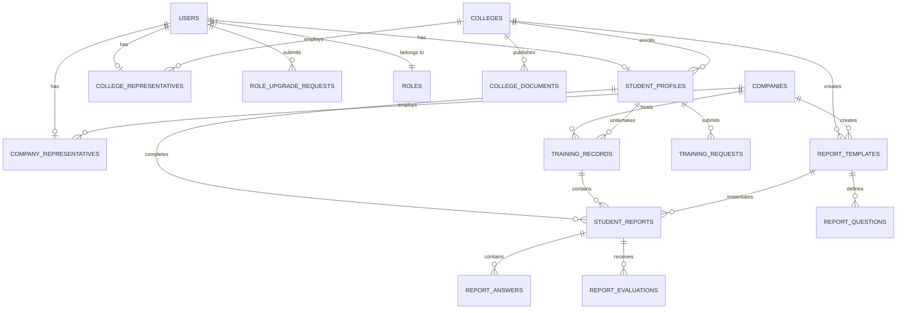

# Summer Training Management System (STMS)

A centralized web application designed to streamline, manage, and monitor university summer training and internship programs across students, academic colleges, host companies, and system administrators.

---

## Overview

The **Summer Training Management System (STMS)** addresses the operational and administrative challenges universities and students face when organizing cooperative summer training programs. In traditional workflows, managing internship requests, verifying student eligibility, coordinating with host companies, and collecting evaluation reports involves fragmented communication and manual paperwork.

This system provides a unified, role-driven platform that orchestrates the entire summer training lifecycle:
- **Registration & Role Verification**: Users register and submit verification proofs to be onboarded as students, college representatives, or company supervisors.
- **Training Request Lifecycle**: Students apply for training opportunities with host companies, submit acceptance letters, and obtain formal college review and approval.
- **Field & Academic Progress Tracking**: Active internships are tracked with structured status milestones (Not Started, Active, Completed, Terminated, Failed).
- **Dynamic Periodic Reporting & Dual-Phase Evaluation**: Academic and company supervisors can create customized evaluation templates with dynamic question types. Students submit periodic reports, review their submissions, and evaluators inspect responses with in-browser document preview before submitting scores.
- **Administrative Governance**: Super administrators manage the system's institutional registry (colleges, companies, representatives), audit role requests, and supervise program statistics.

---

## Key Features

### Authentication & Account Onboarding
- **JWT-Based Authentication**: Secure stateless authentication using JSON Web Tokens containing user identity, role, and institutional claims.
- **Password Security**: Password hashing and verification using `BCrypt.Net-Next` with work factor 12.
- **Role Upgrade Workflow**: Newly registered users (`BasicUser`) can request account upgrades to `Student`, `CollegeRep`, or `CompanyRep` by submitting official details and proof documents. Super administrators and college representatives review, approve, or reject these requests with custom feedback.

### Internship & Training Management
- **Training Request Submissions**: Students submit formal training requests specifying company details, academic year, semester, training duration, and digital acceptance letters.
- **Academic Review Workflow**: College coordinators review pending student training requests, validating company assignments and training periods before official approval.
- **Training Record Tracking**: Automatic generation of `TrainingRecord` entities upon approval, tracking training status (`NotStarted`, `Active`, `Completed`, `Terminated`, `Failed`).

### Dynamic Reporting & Multi-Phase Evaluations
- **Dynamic Template Builder**: College and company representatives construct customized report templates featuring multiple question formats (Text, Multiple-Choice, Dropdowns, Star Rating Scales, Dates, Times, Booleans, and File Uploads).
- **Periodic Student Submissions & Review**: Enrolled students fill out and submit assigned reports. Students can inspect their submitted answers in read-only mode and delete unreviewed submissions if they need to re-fill and re-submit.
- **Integrated Supervisor Evaluation**: Company supervisors (`CompanyEvaluation`) and college academic advisors (`CollegeEvaluation`) inspect student answers and attachments in an all-in-one review & evaluate modal before recording scores (`Poor`, `Fair`, `Good`, `VeryGood`, `Excellent`) and feedback remarks.

### Document & File Management
- **Secure File Storage**: Dedicated service managing acceptance letters, role upgrade proofs, college guidelines, and report attachments.
- **In-Browser Document Preview**: Built-in modal viewer allowing users and supervisors to preview uploaded PDFs and images directly inside the application without mandatory downloads.
- **Security Validations**: Strict MIME/extension validation (`.pdf`, `.png`, `.jpg`, `.jpeg`, `.doc`, `.docx`, `.xls`, `.xlsx`), 10 MB file size cap, GUID-based file renaming to prevent collisions, and directory traversal defense.

### Multi-Role Dashboards & Administration
- **SuperAdmin Dashboard**: System-wide statistics (student count, active trainings, pending approvals), full user lifecycle controls (activate/deactivate, password resets), company/college approval, and institution directory management.
- **College Representative Dashboard**: Student roster management, verification request handling, college document distribution, training request approvals, and academic report evaluation.
- **Company Representative Dashboard**: Intern tracking, student profile views, field report evaluation, and company supervisor management.
- **Student Dashboard**: Real-time tracking of training applications, active internship status, pending report submissions, and direct access to college advisor details and published guidelines.

---

## Tech Stack

| Category | Technology | Description |
| :--- | :--- | :--- |
| **Backend Framework** | ASP.NET Core 8.0 (Web API) | High-performance C# RESTful backend |
| **Data Access & ORM** | Entity Framework Core 8.0 | Code-First ORM with SQL Server provider |
| **Database** | Microsoft SQL Server | Relational database engine |
| **Security & Auth** | JWT Bearer & BCrypt.Net | Token-based authorization and secure password hashing |
| **API Documentation** | Swashbuckle / Swagger (OpenAPI) | Interactive API exploration and documentation |
| **Frontend Framework** | React 19 + TypeScript + Vite | Component-based, strongly-typed user interface |
| **State & Data Fetching** | TanStack Query v5 + Zustand | Server state synchronization and client state management |
| **Styling & Icons** | Tailwind CSS v4 + Lucide React | Modern utility-first styling and icon system |
| **Forms & Validation** | React Hook Form + Zod | Schema-driven form handling and validation |
| **Internationalization** | i18next + react-i18next | Multi-language localization support (Arabic & English) |
| **Notifications** | Sonner | Toast notification management |

---

## Backend Architecture

The backend is built following a clean, layered architecture emphasizing separation of concerns, maintainability, and clean code best practices:

```
Backend/
├── Common/
│   ├── Constants/            # Centralized domain ErrorCodes and FileSettings
│   ├── Exceptions/           # GlobalExceptionHandler implementing IExceptionHandler
│   └── Results/              # Result Pattern (Result, Result<T>, Error, ErrorType)
├── Controllers/              # ASP.NET Core API Controllers (Route handlers & HTTP mapping)
│   ├── Auth/                 # Authentication & profile endpoints
│   ├── Dashboard/            # Role-specific dashboard controllers (Admin, College, Company, Student, User)
│   ├── Reports/              # Dynamic report template & evaluation endpoints
│   ├── System/               # System lookups (roles, colleges, companies)
│   └── Training/             # Training requests and status processing
├── Data/
│   ├── Configurations/       # Fluent API EntityTypeConfiguration classes
│   ├── Seed/                 # Database initializer & initial seed data
│   └── SummerTrainingDBContext.cs # EF Core DbContext
├── DTOs/                     # Data Transfer Objects organized by domain
│   ├── Auth/
│   ├── Core/
│   ├── Dashboard/
│   ├── Reports/
│   ├── Shared/
│   └── Training/
├── Entities/                 # Domain Models and Enums
│   ├── Core/                 # User, StudentProfile, College, Company, TrainingRecord, etc.
│   ├── Enums/                # enRoles, enTrainingStatus, enReportStatus, enEvaluationScore, etc.
│   └── Reports/              # ReportTemplate, ReportQuestion, StudentReport, ReportEvaluation, etc.
├── Extensions/               # Helper extensions (ClaimsPrincipalExtensions, ControllerExtensions)
├── Migrations/               # Entity Framework Core schema migrations
├── Services/
│   ├── Interfaces/           # Abstraction layer for business logic
│   └── Implementations/      # Concrete business logic implementations
├── Uploads/                  # Local secure storage for uploaded files
└── Program.cs                # Application bootstrap, DI configuration, and HTTP pipeline
```

### Architectural & Design Decisions

1. **Separation of Concerns**: Controllers act as lightweight HTTP adapters. They validate inputs and delegate business rules, data querying, and transformations to scoped service interfaces (`IAuthService`, `ITrainingService`, `IReportsService`, `IAdminDashboardService`, etc.).
2. **Result Pattern for Business Logic**: Business methods return explicit `Result` and `Result<T>` objects holding either the successful payload or a structured `Error` object (with `Code`, `Description`, and `ErrorType`), avoiding the performance overhead and anti-pattern of using exceptions for normal business validation.
3. **RFC 7807 / RFC 9110 ProblemDetails**: Controller extension methods (`ToProblemDetails`) translate `Result.Error` directly into standardized `ProblemDetails` JSON responses, automatically mapping error types (`NotFound`, `Validation`, `Conflict`, `Forbidden`, `Unauthorized`) to standard HTTP status codes.
4. **Global Exception Handling (`IExceptionHandler`)**: Modern ASP.NET Core 8 `GlobalExceptionHandler` intercepts any unhandled runtime exceptions, logs them with `ILogger`, and outputs a consistent 500 `ProblemDetails` response with a correlation `traceId`.
5. **Dual Identifier Pattern**: Entities use auto-incrementing integer Primary Keys (`Id`) for fast internal relational joins and indexing, while exposing a GUID (`PublicId`) on public API routes to prevent sequential ID guessing.
6. **ACID Transaction Management**: Multi-step operations leverage EF Core execution strategies (`CreateExecutionStrategy`) and explicit transactions (`BeginTransactionAsync`) to ensure resilience and transactional integrity with SQL Server.

---

## Database Design & Data Access

The application uses **Entity Framework Core 8** targeting **Microsoft SQL Server** with a Code-First workflow.



### Database Features Implemented:
- **Global Query Filters**: Soft delete filters (`HasQueryFilter(e => !e.IsDeleted)`) configured on `User`, `Company`, `College`, `TrainingRequest`, and related entities to automatically filter out soft-deleted records across all queries.
- **Filtered Unique Indexes**:
  - `RoleUpgradeRequest`: Unique index on `(UserId, RequestedRoleId)` filtered where `[Status] = 'Pending'`, preventing concurrent duplicate pending requests for the same role.
  - `TrainingRequest`: Unique index on `(StudentId, AcademicYear, Semester, CompanyId)` preventing duplicate submissions for the same training cycle.
  - `ReportEvaluation`: Unique index on `(StudentReportId, Phase)` ensuring one evaluation per phase.
- **SQL Check Constraints**:
  - `CHK_GPA_Range`: Enforces `GPA >= 0 AND GPA <= 5` on `StudentProfile`.
  - `CHK_Dates_Logic`: Ensures `StartDate > GETUTCDATE()` on training requests.
  - `CK_ReportTemplate_Owner`: Enforces that a template is owned exclusively by either a College or a Company.
  - `CK_ReportEvaluation_PhaseOwner`: Ensures that `CompanyEvaluation` records are linked exclusively to company supervisors and `CollegeEvaluation` records exclusively to college advisors.
- **Enum-to-String Conversions**: All domain enums are automatically converted to strings in the database schema (`configurationBuilder.Properties<Enum>().HaveConversion<string>()`) for readable, self-documenting database records.

---

## Authentication & Authorization

Authentication is implemented using stateless **JWT Bearer tokens**:

1. **Authentication Flow**:
   - The client sends credentials to `POST /api/Auth/login`.
   - The backend validates credentials using `BCrypt.EnhancedVerify`, checks account active status, and issues a signed JWT token valid for 12 hours.
   - The JWT payload includes: `sub` (User ID), `NameIdentifier`, `Name` (username), `Role`, `PublicId`, and contextual institutional claims (`CollegeId` or `CompanyId`).
2. **Claims-Based Extraction**:
   - `ClaimsPrincipalExtensions` provides strongly-typed helper methods (`GetInternalUserId()`, `GetPublicUserId()`, `GetUserRoleId()`, `GetCollegeId()`, `GetCompanyId()`) used throughout the controller and service layers.
3. **Role-Based Access Control (RBAC)**:
   - Endpoints are protected with ASP.NET Core `[Authorize(Roles = "...")]` attributes.
   - Distinct role boundaries prevent cross-role data access:
     - `SuperAdmin`: System oversight and entity approvals.
     - `CollegeRep`: Student and training oversight within their assigned college.
     - `CompanyRep`: Internship and evaluation oversight within their assigned company.
     - `Student`: Actions scoped strictly to their personal profile, requests, and reports.
     - `BasicUser`: Restricted to self-profile updates and role upgrade submissions.

---

## Frontend Integration

The frontend is a modern Single Page Application (SPA) built with **React 19**, **TypeScript**, and **Vite**:
- **API Consumption & Error Handling**: Uses **Axios** with request interceptors to automatically attach JWT authorization headers, and response interceptors parsing RFC 7807 `ProblemDetails` payloads.
- **Global Error Handling**: Integrated error modal store (`useErrorModalStore`) displaying friendly localized error dialogs with error codes and correlation trace IDs without crashing the UI.
- **Data Fetching & Caching**: Employs **TanStack Query (React Query v5)** for server state caching, pagination, background refetching, and optimistic mutations.
- **Client State**: Lightweight global state management powered by **Zustand**.
- **Form Management**: Structured forms using **React Hook Form** paired with **Zod** schema validation.
- **In-Browser Document Viewer**: Built-in `FileViewerModal` for instant preview of uploaded files and documents.
- **Role-Based Routing**: Protected routes in React Router dynamically guard views according to the authenticated user's role.
- **Bilingual Interface**: Integrated **i18next** configuration supporting Arabic and English interfaces with RTL/LTR layout handling.

---

## Project Structure

```
SummerTraining-System/
├── Backend/
│   ├── Common/                  # Error codes, Result pattern, and GlobalExceptionHandler
│   ├── Controllers/             # API Controllers (Auth, Dashboard, Reports, Training, Lookups)
│   ├── Data/                    # DbContext, Entity configurations, Migrations, Seed initializer
│   ├── DTOs/                    # Data transfer objects grouped by feature domain
│   ├── Entities/                # Domain models (Core, Enums, Reports)
│   ├── Extensions/              # Claims and ControllerExtensions (ProblemDetails mapping)
│   ├── Services/                # Service interfaces and implementations
│   ├── Uploads/                 # Storage for uploaded letters, proofs, and documents
│   ├── appsettings.json         # Configuration (Connection strings, JWT settings)
│   ├── Program.cs               # Application entry point & service registration
│   └── summer-training-app.csproj
├── Frontend/
│   ├── src/
│   │   ├── api/                 # Axios client instance and API endpoint functions
│   │   ├── assets/              # Static media assets
│   │   ├── components/          # Reusable UI components (Modals, Tables, Forms, Layouts, Viewers)
│   │   ├── i18n/                # Localization configurations and translation files
│   │   ├── layouts/             # Dashboard and authentication layout wrappers
│   │   ├── pages/               # Page views grouped by role (admin, college, company, student, user)
│   │   ├── router/              # Route definitions and role guards
│   │   ├── store/               # Zustand state stores (auth, UI, error modal)
│   │   ├── types/               # TypeScript interfaces matching backend DTOs & Enums
│   │   ├── utils/               # Error formatting and helper utilities
│   │   ├── App.tsx              # Root component
│   │   └── main.tsx             # Application bootstrap
│   ├── package.json             # NPM dependencies and build scripts
│   └── vite.config.ts           # Vite configuration
└── README.md
```

---

## Getting Started

### Prerequisites
- **.NET 8.0 SDK** ([Download](https://dotnet.microsoft.com/download/dotnet/8.0))
- **Microsoft SQL Server** (LocalDB, Express, or Developer Edition)
- **Node.js** (v18.x or higher) & **npm**
- **Git**

---

### Backend Configuration & Setup

1. **Navigate to the Backend directory**:
   ```bash
   cd Backend
   ```

2. **Configure Connection String & JWT**:
   Open `appsettings.json` (or `appsettings.Development.json`) and configure your SQL Server connection string and JWT secret:
   ```json
   {
     "ConnectionStrings": {
       "DefaultConnection": "Server=localhost;Database=summer-training-db;Trusted_Connection=True;MultipleActiveResultSets=true;TrustServerCertificate=True"
     },
     "Jwt": {
       "Key": "Your_Super_Secret_Key_That_Must_Be_At_Least_32_Characters_Long!",
       "Issuer": "SummerTrainingAPI",
       "Audience": "SummerTrainingReactApp"
     }
   }
   ```

3. **Restore Dependencies**:
   ```bash
   dotnet restore
   ```

4. **Run Database Migrations & Seeding**:
   The application automatically applies pending migrations and executes `DatabaseInitializer.InitializeAsync` on startup to seed default test accounts.
   To run migrations manually via CLI:
   ```bash
   dotnet ef database update
   ```

5. **Run the Backend API**:
   ```bash
   dotnet run
   ```
   The backend API will start on `https://localhost:7000` (or `http://localhost:5000`).

---

### Default Seed Accounts

When the database initializes, the following test accounts are automatically provisioned:

| Role | Username | Default Password | Access Scope |
| :--- | :--- | :--- | :--- |
| **Super Admin** | `admin` | `admin123` | Full system administration |
| **College Representative** | `col` | `col123` | College-level student and request management |
| **Company Representative** | `com` | `com123` | Company intern tracking and field evaluations |
| **Student** | `stu` | `stu123` | Training application and report submission |
| **Basic User** | `yazeed` | `yaz123` | Unassigned user (can request role upgrade) |

---

### Frontend Configuration & Setup

1. **Navigate to the Frontend directory**:
   ```bash
   cd Frontend
   ```

2. **Install NPM Dependencies**:
   ```bash
   npm install
   ```

3. **Start the Development Server**:
   ```bash
   npm run dev
   ```
   The React application will be available at `http://localhost:5173`.

---

## API Documentation

When running the backend in development mode, interactive Swagger / OpenAPI documentation is available at:

```
https://localhost:7000/swagger
```

You can test endpoints directly in the browser by providing a Bearer token obtained from the `POST /api/Auth/login` endpoint via the **Authorize** button (`Bearer <token>`).

---

## Screenshots

> *Screenshots demonstrating the multi-role dashboards, training request workflows, and report evaluation system.*

| Admin Overview | College Training Management |
| :---: | :---: |
| *(Placeholder: Add Admin Dashboard Screenshot)* | *(Placeholder: Add College Dashboard Screenshot)* |

| Dynamic Report Template Builder | Student Evaluation & Progress |
| :---: | :---: |
| *(Placeholder: Add Report Builder Screenshot)* | *(Placeholder: Add Evaluation View Screenshot)* |

---

## Future Improvements

- [ ] **Automated Email Notifications**: Integrate an SMTP/SendGrid service to send automated notification emails upon training request decisions and evaluation submissions.
- [ ] **Automated Test Suite**: Implement unit tests (xUnit + Moq) for service business logic and integration tests (WebApplicationFactory + Testcontainers) for API endpoints.
- [ ] **Cloud Storage Provider**: Add support for cloud object storage (e.g., Azure Blob Storage or AWS S3) as an alternative to local disk storage for production environments.
- [ ] **Export & Reporting Tools**: Add PDF/Excel export capabilities for completed student training records and final evaluation transcripts.

---

## Author & Contact

**Yazeed Ahmed**  
Backend / Software Developer (.NET & C#)  
- GitHub: [@Yazeed70](https://github.com/Yazeed70)
